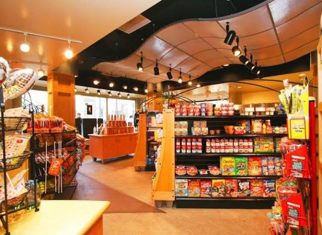
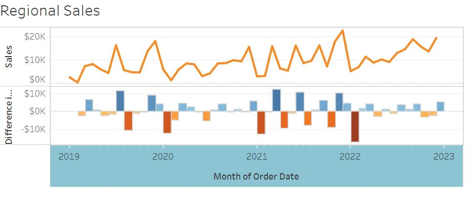
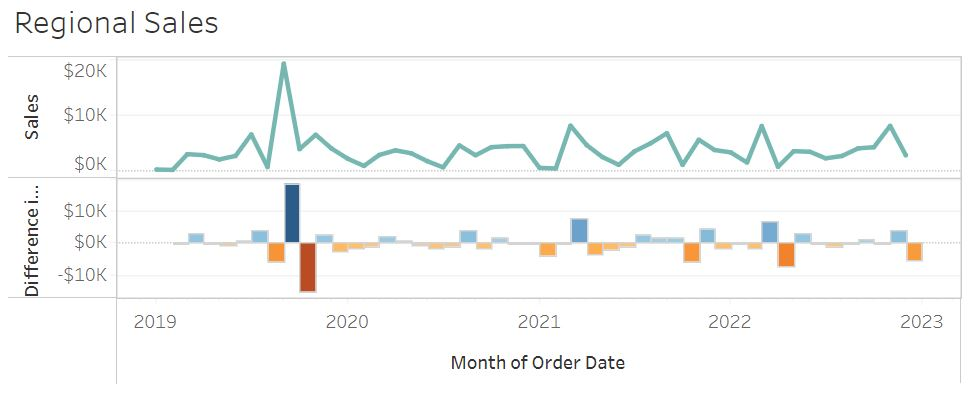
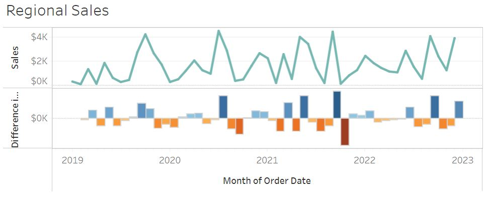
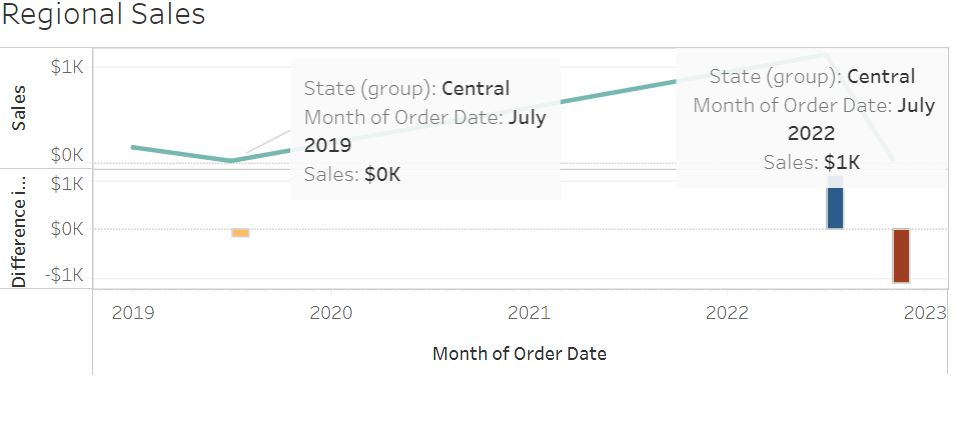
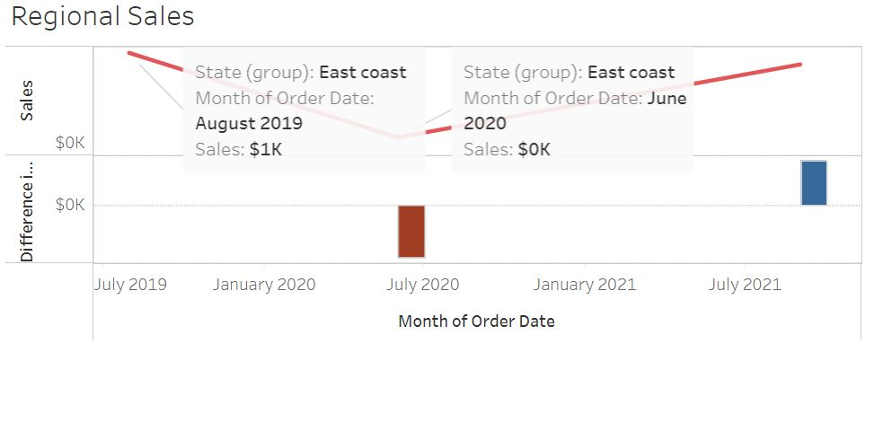
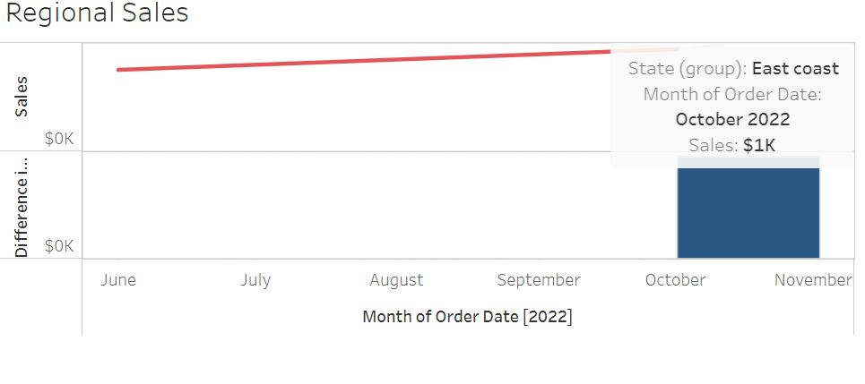
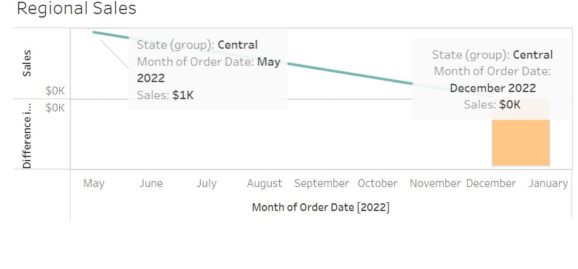

# Sales-Analysis-Staplestores

---

## Introduction:

This is a power Bi project on sales analysis of an imaginary store called **Staple Stores**. The project Is to analyze and derive insights to answer crucial questions and help the store make data driven decisions.
**_Disclaimer:_** _All datasets and reports do not represent any company, institution or country, but just a dummy dataset to demonstrate capabilities of Power BI._

## Problem statement:

1. Which state had the highest sales?
2. Which state had the most unstable sales record 
3. What is the best performing state?
4. Lowest Performing state?

## Skills/ concepts demonstrated:
The following Power Bu features were incorporated-
- Bookmarking
- Quick measures
- Page navigation
- Filters 
- Tooltips 
- Button
- Annotation

## Visualization:

The report comprises 4 pages:
1. Which state had the highest sales?
2. Which state had the most unstable sales record?
3. What is the best performing state?
4. Lowest Performing state?

[You can interact with the report here](https://public.tableau.com/app/profile/ihekweme.ruby/viz/Salesdashboard_16505394663940/SalesDashboard)

## Highest sales:
---

### Analysis:

- The state that recorded the highest sales was california with a total sales of $458k and this can be as a result of the high population in california. 

## Sales Trend:
---

Florida                |        Texas
:---------------------:| :-----------------------:
      |      

### Analysis:

- The state that had the most fluctuating sales is Florida which recorded its highest sales in march 2019 of $26k, and after that recorded $0k in June 2019 and did not record anyother high until August 2022 of $5k

- Texas which had the 3rd highest sales of $170k also recorded inconsistent inflow month-in-month-out with a high of $19k and never reached a weak till december 2022.

## Best performing state:
---

### Analysis:

- Illinois had the most stable sales/inflow, with the lowest sales $0k and the highest $5k. Unlike New York that had $0k as its lowest and $25k as its highest sales, amongst other states like California, Texas, and Washington.

## Lowest Sales:
---

Maine                     |            West Virginia
:-----------------------: | :---------------------------:
         |      

South Dakota              |            North Dakota
:------------------------:| :---------------------------:
       |      

### Analysis:

- The lowest performing states are Maine, West Virginia, South Dakota, amd North Dakota which recorded $1k sales respectively

## Conclusion and Recommendations:
---

- Illinois has the highest impact on income although relatively negligible.
- States generating highest sales does not mean that they have stability 
- Management can introduce a discount in low sales region to encourage sales and capitalize on high population areas to cover up for it. 

